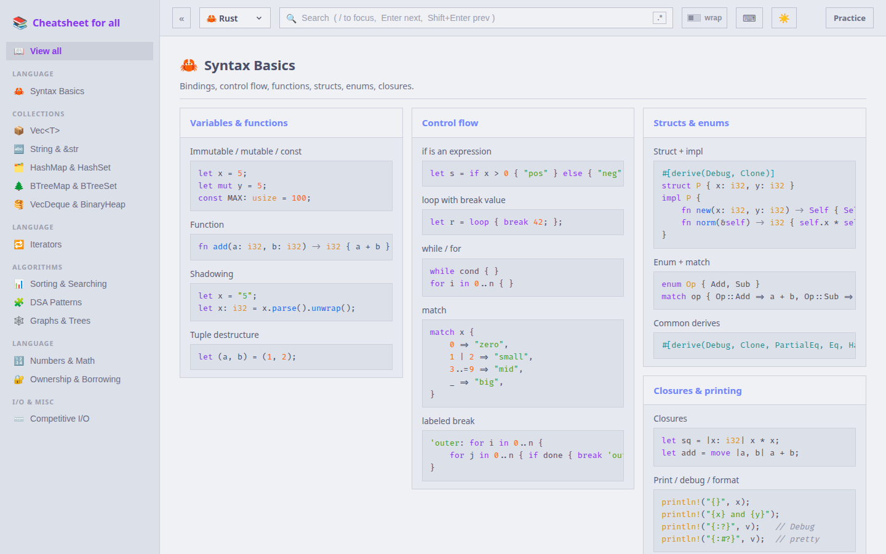

# Cheatsheet for all

Fast, searchable DSA (Data Structures & Algorithms) cheatsheets for LeetCode and
competitive programming — across **Rust, C++, Python, Java, and Lua**.

Catppuccin themed (Latte / Mocha), regex search with match highlighting,
Vim keybindings, and a practice mode.



## Features

- **5 languages** — switch with number keys or the language picker.
- **Cards** — every cheatsheet is a grid of topic cards with copyable code.
- **Regex search** — toggle `.*` in the search bar. Matches highlight across
  the page and you can jump between them.
- **Vim keybindings** — `/`, `n`/`N`, `j`/`k`, `d`/`u`, `gg`/`G`, `[`/`]`, `t`,
  `?`. Press `?` in the app for the full list.
- **Catppuccin theme** — Latte (light) + Mocha (dark). Toggle with the sun/moon
  or `t`. Choice + last-viewed sheet persist in `localStorage`.
- **Syntax highlighting** — `highlight.js` grammars mapped onto Catppuccin.
- **LLM-friendly** — `llms.txt` and `llms-full.txt` with all content in plain
  text for AI/LLM consumption.
- **Practice mode** — test your knowledge against the cheatsheets.

## Run

```bash
npm install
npm run dev        # dev server
npm run build      # production build -> dist/
npm run preview    # serve the build
```

## Keybindings

| Key | Action |
| --- | --- |
| `/` | Focus search |
| `Enter` / `n` | Next match |
| `Shift+Enter` / `N` | Previous match |
| `j` / `k` | Scroll down / up |
| `d` / `u` | Half page down / up |
| `gg` / `G` | Top / bottom |
| `[` / `]` | Previous / next cheatsheet |
| `1`–`5` | Switch language |
| `t` | Toggle theme |
| `p` | Toggle practice mode |
| `?` | Toggle help |
| `Esc` | Blur search / close help |

## Adding a cheatsheet

Cheatsheets are plain data — no wiring needed. Drop a new `*.js` file into
`src/data/cheatsheets/` that default-exports an object. It's auto-discovered
and shows up in the sidebar.

```js
// src/data/cheatsheets/14-my-topic.js
export default {
  id: "my-topic",          // unique, url-friendly
  title: "My Topic",       // sidebar + heading
  subtitle: "Rust",        // language label (shown in "all" view)
  icon: "⚡",               // any emoji
  lang: "rust",            // one of: rust, cpp, python, java, lua
  group: "Algorithms",     // sidebar section (existing or new)
  order: 14,               // sort order within the app
  description: "One-line summary shown under the title.",
  cards: [
    {
      title: "A card title",
      note: "optional intro text",
      items: [
        { desc: "What this does (supports `inline code`)", code: "let x = 1;" },
        { desc: "Another snippet", code: "let y = 2;" },
      ],
    },
  ],
};
```

**Fields**

- `id` `title` `icon` `lang` `group` `order` — metadata.
- `description` — optional subtitle.
- `cards[]` — each renders as a card.
  - `title` — card header.
  - `note` — optional text under the header.
  - `items[]` — `{ desc, code }`. `desc` supports \`inline code\`.

## Project layout

```
scripts/gen-seo.mjs        build-time SEO / LLM assets generator
public/robots.txt           generated
public/sitemap.xml          generated
public/llms.txt             generated (LLM index)
public/llms-full.txt        generated (full plain-text content)
src/
  data/
    index.js                auto-discovery of cheatsheets
    cheatsheets/*.js        <- your content lives here
  components/               Header, Sidebar, Sheet, Card, CodeBlock, AllSheets
  hooks/                    useTheme, useSearch (CSS Highlight API), useVimKeys
  index.css                 Catppuccin palettes + globals
  App.css / App.jsx
```

## Deploy

The project includes `vercel.json` for Vercel deployment. Import the repo or use
the Vercel CLI — framework auto-detection picks up Vite. Set `SITE_URL` to your
custom domain in the Vercel project for correct sitemap/LLM links.
